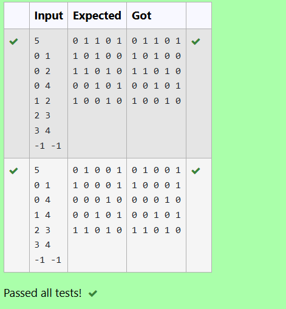

# Ex21 Representation of Graph
## DATE:23/04/25
## AIM:
To write a C program to display the adjacency matrix of the given graph by supplying the edges and the number of vertices.

## Algorithm
1.Start<br/>
2.Read the value of V (number of vertices).<br/>
3.Declare an adjacency matrix adjMatrix[V][V].<br/>
4.Initialize the matrix to 0 using the init function.<br/>
5.Calculate the maximum number of edges me as n * (n - 1) / 2.<br/>
6.For each edge, read e1 and e2, add the edge to the adjacency matrix, and stop if e1 == -1 && e2 == -1.<br/>
7.Print the adjacency matrix.<br/>
8.End<br/>  

## Program:
```c
/*
Program to display the adjacency matrix of the given graph

Developed by: Santhosh T
RegisterNumber: 212223220100

/*#include<stdio.h>
int V;

//init matrix to 0
void init(int arr[][V])
{
int i,j;
for(i = 0; i < V; i++)
for(j = 0; j < V; j++)
arr[i][j] = 0;
}
*/
int main()
{
    int e1,e2,me,n,i;
    scanf("%d",&V);
    int adjMatrix[V][V];
    init(adjMatrix);
    n=V;
    me=n*(n-1)/2;
    for(i=0; i<me; i++)
    {
        scanf("%d%d",&e1,&e2);
        addEdge(adjMatrix,e1,e2);
        if(e1==-1 && e2==-1)
        {
            break;
        }
    }
    printAdjMatrix(adjMatrix);

}

*/

```

## Output:




## Result:
Thus, the C program to print the adjacency matrix of the given graph is implemented successfully.
