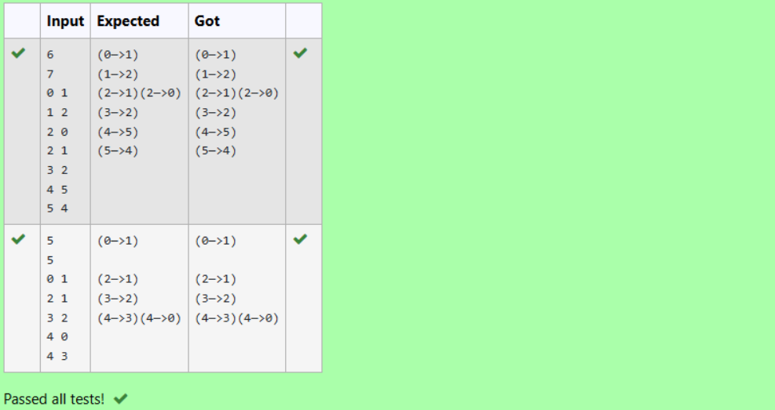

# Ex25 Adjacency List Representation
## DATE: 07/05/25
## AIM:
To write a C program to represent the given graph using the adjacency list.

## Algorithm
1. Initialize variables: 
   - Declare `n` and `i` as integers.<br>
   
2. Read the number of vertices: 
   - Use `scanf` to read the value of `N` (number of vertices).<br>
   - Use `scanf` to read the value of `n` (number of edges).<br>
   
3. Input edges of the graph: 
   - Declare an array `edges` of type `struct Edge` with size `n`.<br>
   - For each edge `i` from `0` to `n-1`:<br>
     - Use `scanf` to read the source vertex `edges[i].src`.<br>
     - Use `scanf` to read the destination vertex `edges[i].dest`.<br>
   
4. Construct the graph: 
   - Call `createGraph(edges, n)` to create a graph from the given edges and store the result in `graph`.<br>
   
5. Print the graph: 
   - Call `printGraph(graph)` to print the adjacency list representation of the graph.<br>
   
6. End the program: 
   - Return `0` to indicate successful completion.<br>

## Program:
```c
/*
Program to find and display the priority of the operator in the given Postfix expression

Developed by: Santhosh T
RegisterNumber: 212223220100
*/
int main(void)
{   int n,i;
    scanf("%d",&N);
    scanf("%d",&n);
    // input array containing edges of the graph (as per the above diagram)
    // (x, y) pair in the array represents an edge from x to y
    struct Edge edges[n];
    for (i = 0; i < n; i++)
    {
        // get the source and destination vertex
        scanf("%d",&edges[i].src);
        scanf("%d",&edges[i].dest);
      
    }
   
    // construct a graph from the given edges
    struct Graph *graph = createGraph(edges, n);
 
    // Function to print adjacency list representation of a graph
    printGraph(graph);
 
    return 0;
}

```

## Output:




## Result:
Thus, the C program to represent the given graph using the adjacency list is implemented successfully
